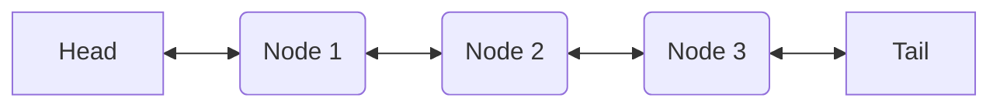

# Deque

## Introduction

A Deque is a data structure that can act as both a stack and a list. This
enables their efficient use in situations that requires efficient modifications
or access to the first node.

* Stack
  * A data structure that follows the pattern of first in last out (FILO)
  * Think a stack of cards
* Queue
  * A data structure that follows the pattern of first in first out (FIFO)
  * Think a real life queue or line

## Implementation

There are two main implementation options for a deque: linked list or array.
The [following StackOverflow post](https://stackoverflow.com/a/56777839/3262054)
compares how this two implementations measure up. The summary:

* Linked List Based Implementation
  * How it works
    * Double Linked List
    * Node container objects store both the reference to the data and
    references to other nodes that represent the parent / child of the node
    * Insertions and deletions simply change the references of the nodes'
    parents and children
  * Pros
    * Wost case insert is $O(1)$ at the ends and is $O(n)$ in the middle where
    $n$ is the distance to the closest index (either the head or the tail)
    * Cost of removing an element from the ends is worst case $O(1)$
  * Cons
    * Poor
    [locality of reference](https://en.wikipedia.org/wiki/Locality_of_reference)
    which negatively affects caching performance
* Array Based Implementation
  * How it works
    * A circular buffer array stores references to the data and the immediate
    neighbors represent the parent and child nodes
    * The parent class stores the index of the head and tail of the array
    * When the array becomes full, it is copied to another array double the size
    and the opposite happens when it becomes too small
    * On node insertions or deletions, all elements shift forward or backward
  * Pros
    * Great locality of reference since the nodes are stored contiguously
  * Cons
    * Worst case insertion of $O(n)$ due to the copy, though it is amortized
    across the $n$ insertions
      * Thus, average insertion / deletion time at the ends is $O(1)$

This particular implementation chooses to implement a deque as a **Double
Linked List** and matches the `collections.deque` implementation to a T. The
following diagram depicts how a doubly linked list is constructed.

Some other interesting implementation tidbits

* `Deque` implements all of the dunder methods that `collections.deque` supports
  * dunder methods are the magic methods in python and is similar to operator
  overloading in other languages
  * A dunder is a [double underscore](https://en.wiktionary.org/wiki/dunder)
* CPython has some [semi-magical functionality](https://stackoverflow.com/a/15849554/3262054)
that traverses the stack to check if an object is self-referential before it prints
out its representation
* The `Deque` uses and iterator class rather than python generators since
[generators cannot be pickled](https://bugs.python.org/issue1092962)
  * `Deque` also supports both `copy.copy` and `copy.deepcopy`
* You can simply define `__eq__` and `__lt__` and use `functools.total_ordering`
[to define the rest of the comparator dunder methods](https://docs.python.org/3/library/functools.html#functools.total_ordering).
* This implementation uses the same approach as the builtin `collections.deque`
to track when a modification to the `Deque` is made during iteration
  * An `__state` variable is incremented on any operation that modifies the
  `deque`
  * On all `deque` querying operations, we confirm that the `__state` has not
  changed
